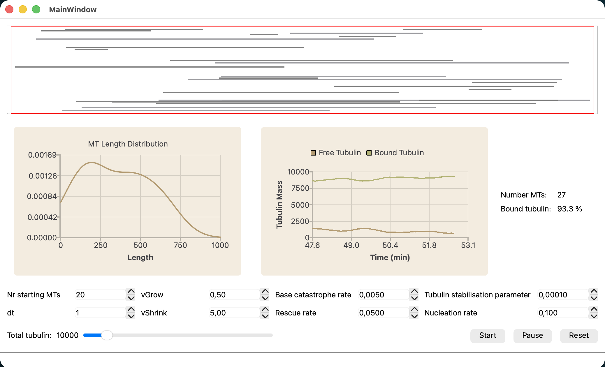

# Microtubule Population Dynamics

Ecological Modelling with C++ (M.FES.726)

## Research question

Microtubules (MTs) are dynamic cytoskeletal polymers composed of α/β-tubulin dimers that play essential roles in intracellular transport, structural support, and cell organization. In neuronal axons, microtubules form elongated filament networks that continuously undergo stochastic growth and shrinkage, a behavior known as dynamic instability, which is regulated by tubulin availability and state transitions between polymerization and depolymerization. With this simulation, I want to address the following question:

**RQ: How do tubulin availability and stochastic state transitions regulate steady-state microtubule population dynamics in a confined axonal compartment?**

The model is a coupled resource-limited stochastic population system. It explicitly includes:

- tubulin limitation
- stochastic catastrophe and rescue
- nucleation
- geometric confinement

More quantitatively, one could ask: How do catastrophe, rescue, and nucleation rates influence mean microtubule length, microtubule number, and free tubulin concentration over time? The parameters can be adjusted and their individual influence can be directly observed over time.

Initially, the idea was to create an Alzheimer model with local tau fields that destabilize the MTs, and then model drug administration to find out how an externally induced stabilization mechanism can counter the aging-related destabilization. This was an idea directly taken from my bachelor thesis with the title: *Microtubule-Stabilising Agent Pelophene B Exhibits Reduced Efficacy in Modulating Microtubule Organisation in Axons of Model Neurons Compared to Epothilone D as Shown by DNA-PAINT and FDAP Experiments* (Hesenkamp, 2023). However, already while approaching MVP 1 (basic graphical setup and MT functionality, no complicated biological processes) it became clear quite quickly that this would be amazingly complex.

## Design philosophy

The design loosely follows a MVC approach: the SimulationEngine serves as controller for the simulation and, at the same time, owns the biological model and the logic contained in the Microtubule class, whereas the MainWindow takes care of the visuals (view). 

Using Qt's own callback technique called *signals and slots*, the controller can post updates and the view just needs to listen as opposed to the view "reaching" into the controller or the model to pull information.

This way, model, view, and controller all stay separate and handle their own logic while still being able to communicate with each other indirectly. (Technically, like this the simulation could also be run headless.) 

(NB: a lot of biology still ended up in the SimulationEngine, and while technically these can be seen as controlling mechanisms a further compartmentalization might have been sensible.)

## Pseudo code
This section walks the reader roughly through what is happening.

1. Startup.
The MainWindow constructor creates ui and engine and sets up the scene.

2. Start button  
  2.1 Init.
  The parameters are read from the GUI, the axon initialises with a pre-defined number of MT "seeds", they MainWindow draws them on screen.  
  2.2 Timer start  
  2.3 Step.
  All modelling happens in here, like growth, shrinkage, nucleation, deletion  
  2.4 Drawing.
  After every step, the GUI is updated with the latest data

3. Pause button.
Stops the timer, which in turn does not evoke further steps

4. Reset button.
Resets all data and visuals to restart the simulation from scratch.

## Biological grounding

Reviewing the literature (e.g. *Molecular mechanisms underlying microtubule growth dynamics* (Cleary & Hancock, 2021)), most existing MT dynamics models are highly complex and, hence, this model can only serve as an intentionally simplified abstraction focusing on number of isolated biological processes. The model should therefore be interpreted as a qualitative exploration of coupled stochastic MT dynamics rather than as a quantitatively predictive biological simulation.

Simplifications:

- Tubulin as limited resource is treated as uniformly available throughout the axonal compartment. In reality, free tubulin concentration can vary locally because rapid depolymerization releases tubulin near shrinking MTs while polymerization consumes it locally. However, a spatial gradient was omitted because free tubulin diffuses relatively quickly and because active intracellular transport contributes to redistribution; for the scale of this model, a well-mixed approximation is sufficient.
- Microtubules are represented as one-dimensional line segments with only length and position, without explicit protofilament structure. Real microtubules consist of 13 protofilaments and exhibit lattice-level effects such as seam formation and local defects, which are beyond the intended scope here.
- Dynamic instability is reduced to two discrete states: growing and shrinking. Intermediate states such as pausing or partial rescue events are ignored in order to keep state transitions computationally simple.
- Catastrophe and rescue are implemented as stochastic processes with constant base rates, modified only by free tubulin concentration in the case of catastrophe. In reality, both processes depend on additional factors such as GTP cap size, associated proteins, and mechanical stress (which is actually included in the form of hitting the axon wall).
- Nucleation occurs probabilistically whenever sufficient free tubulin is available, without modelling biological nucleation centres such as $\gamma$-TuRC. This means new MT formation is biologically abstracted into a concentration-dependent event.
- No interactions between microtubules are implemented. Real axonal MTs can bundle, crosslink, compete for space, and mechanically influence each other.
- **Disease-related processes such as tau-mediated destabilization were intentionally excluded from the final implementation because the baseline dynamics already required substantial complexity.**

## Learnings

Realising this project has had a great learning effect for me personally. Besides the relatively steep learning curve that c++ requires, I particularly took away the following:

- The very explicit programming required in c++, demanding a thoroughly thought through approach to basically everything. There is no "I'll declare this now and then see what I can do with it later". Unlike in high-level languages such as Python, many structural decisions need to be made early because types, ownership, and interfaces matter immediately.
- Conceptualisation and structuring of a non-trivial project from scratch. Breaking functionality into logical units early proved valuable, even though several (!) design decisions were revised during implementation. The engineering paradigm "ship early, iterate often" describes my approach really well, keeping feedback loops tight to catch errors and unnecessary fluff early.
- OOP and encapsulation in c++. Separating MT state, simulation logic, and rendering forced a more disciplined handling of responsibilities between classes. While certainly not new to me, I was forced to keep to a strict workflow, which was good practice. 
- The MVC-inspired separation between simulation logic and graphical interface improved maintainability and made debugging easier
- Qt's signals and slots provided a practical introduction to event-driven programming and decoupled communication between components
- Biological modelling under technical constraints: many biologically attractive ideas turned out computationally expensive or conceptually difficult to integrate cleanly within the available timeframe.

## AI usage

This project used generative AI selectively as a support tool during conceptualization and development. AI assistance was used for:

- design decisions
- discussing biological plausibility of simplified modelling assumptions
- implementation
- debugging

Generated suggestions were critically reviewed and adapted before inclusion, if not noted otherwise.

Generally, I prefer to use [Claude](https://claude.ai/) for most things code-related, as it hs proven to be one of the best models for software engineering tasks. I typically have a sepcific question in mind and try to describe the problem with all constraints. Claude will then come up with a suggestion, which I evaluate and iterate, if necessary. This is already immensely helpful during the design stage, where I can describe what I want to achieve and get real-time feedback on how realistic and sensible my approach is.

If I encounter specific approaches (e.g. wanting to follow an MVC approach or creating a specific style of chart), I will also use the LLM as a resource for learning. Rather than going through needlessly complicated documentations (which is still very much a helpful skill), I can basically create my own, personalized tutorial with AI and then learn step-by-step, asking follow-ups wherever necessary. Claude is also very helpful when it comes to debugging, as it allows to upload multiple files (and recently has expanded its context window to 1M tokens), which can help catching program-wide errors.

During this project, I have also used Google's Gemini (preferrably in Thinking or Pro Mode) and OpenAI's GPT. 

## Sources
Cleary J, Hancock W. Molecular mechanisms underlying microtubule growth dynamics. Current Biology, 31, R560-R573. [doi.org/10.1016/j.cub.2021.02.035](doi.org/10.1016/j.cub.2021.02.035)